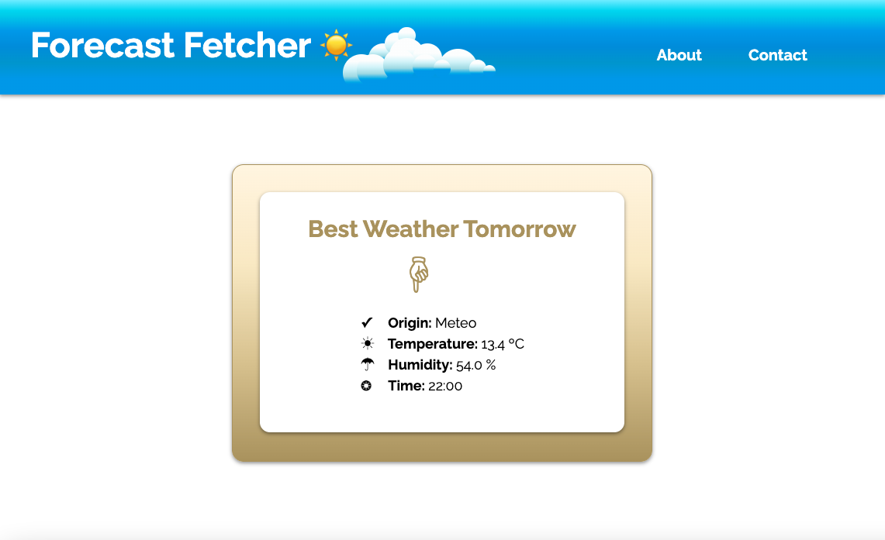

# FORECAST FETCHER

## User Interface

---

## Description

A web service that fetches data with REST from multiple open weather forecast services, returning the best / warmest weather forecast for Stockholm 24 hours in advance. The forecast is delivered as a user viewable webpage as well as a REST web service.

---

## Technologies used

- Spring Boot
- MVC
- REST
- Thymeleaf
- HTML
- CSS
- Json

---

## More UI

